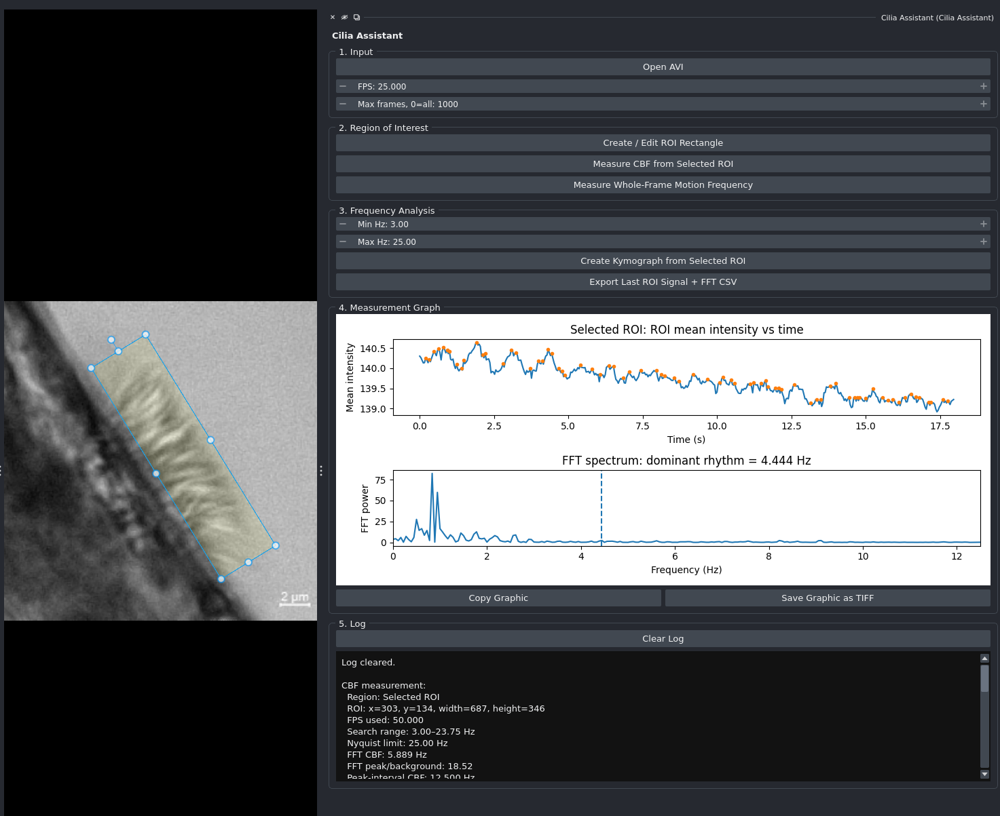

## Demo

[](https://raw.githubusercontent.com/wulinteousa2-hash/napari-cilia-assistant/main/docs/ui.mp4)


# napari-cilia-assistant

`napari-cilia-assistant` is a napari plugin for transparent, ROI-based quantification of ciliary beat frequency (CBF) from high-speed AVI microscopy videos.

The plugin is designed for collaborative scientific review. It opens AVI files, reads acquisition metadata, loads a selected movie as a napari time stack, lets the user place a rectangular ROI over visibly beating cilia, computes a time-intensity trace, estimates the dominant beat frequency by FFT, provides a peak-interval sanity check, generates a kymograph, and exports raw signal/FFT data plus a combined batch results table.

## Installation for development

Install Miniconda or Anaconda first. Then open a terminal and run:

```bash
conda create -n cilia-assistant python=3.11 -y
conda activate cilia-assistant
conda install -c conda-forge napari pyqt git -y
git clone https://github.com/wulinteousa2-hash/napari-cilia-assistant.git
cd napari-cilia-assistant
pip install -e .
napari
```

In napari, open `Plugins > Cilia Assistant`.


## Scientific purpose

The goal is to support a defensible first-pass measurement of ciliary motion from high-speed video data. The current implementation quantifies rhythmic motion frequency, not full ciliary waveform or clinical diagnostic beat-pattern classification.

Use this tool to answer questions such as:

- Are cilia beating within the selected region?
- What is the dominant CBF in this ROI?
- Does WT and mutant/KO tissue show a measurable difference in rhythmic cilia motion?
- Does treatment shift the dominant CBF compared with control videos?
- Is the measured frequency supported by both the FFT plot and the kymograph?

## Current features

### Single-video workflow

- Open one AVI video through the napari widget.
- Read and display AVI metadata: FPS, frame count, duration, width, height, and codec.
- Load AVI data as a grayscale `T, Y, X` image stack.
- Create/edit a napari rectangular ROI over active cilia.
- Measure ROI mean-intensity change over time.
- Estimate CBF using FFT dominant-frequency analysis.
- Estimate CBF using a peak-interval method as an independent sanity check.
- Plot ROI intensity versus time with detected peaks.
- Plot FFT power spectrum and mark the reported dominant frequency.
- Generate a kymograph layer from the selected ROI.
- Export the last ROI signal and FFT spectrum as CSV files.
- Clear the log panel between videos or measurement runs.
- Copy the current measurement graph to the clipboard.
- Save the current measurement graph as a TIFF image.

## Reviewer-facing method summary

High-speed AVI videos were loaded as grayscale time stacks. For each measurement, a rectangular ROI was manually positioned over a region containing visibly beating cilia. The mean pixel intensity within the ROI was calculated for every frame to generate a one-dimensional temporal signal. The signal was detrended, mean-centered, windowed with a Hanning window, and transformed into the frequency domain using a real-valued FFT. The dominant frequency within a user-defined CBF search range was reported as the primary CBF estimate. A second estimate was obtained from the median interval between detected peaks in the same ROI time-intensity signal. A kymograph was generated from the center line of the ROI to provide a visual audit of periodic motion.

For batch analysis, each AVI is treated as an independent video record with its own file path, metadata, group label, FPS value, ROI coordinates, FFT result, peak-interval result, QC status, and notes. The combined CSV output allows WT/KO or treatment-control comparisons to be reviewed outside napari.

The exported CSV files contain the exact time-intensity trace and FFT spectrum used for the last measurement, and the batch CSV contains the per-video summary table used for comparison.

## Why this approach is scientifically reasonable

High-speed video microscopy is a standard approach for evaluating ciliary beat frequency and beat pattern. Chilvers and O'Callaghan directly compared digital high-speed video analysis with photomultiplier and photodiode approaches and showed that method-specific measurements are not interchangeable, supporting the need to report the method and maintain consistent analysis conditions.

Jackson and Bottier reviewed modern human airway ciliary-function assessment and described CBF as a quantitative measure influenced by environmental and technical factors, including temperature, pH, medium, additives, vibration, and time from sampling. They also note that HSVA recordings can be analyzed within an ROI and that CBF can be measured computationally using tools such as SAVA, ciliaFA, Fiji/ImageJ FFT plugins, and CiliarMove.

Francis described a practical mouse airway cilia protocol using high-speed video microscopy, kymograph-based CBF counting, and microsphere tracking for cilia-generated flow. That protocol supports the use of high-speed imaging, kymographs, and visible audit of cilia motion as part of quantitative motility assessment.

## Recommended acquisition and analysis conditions

For publication-quality reporting, record and report:

| Item | Why it matters |
|---|---|
| Frame rate / FPS | Converts frame intervals and FFT frequency bins into Hz. Wrong FPS gives wrong CBF. |
| Number of frames analyzed | Determines frequency resolution and stability of FFT estimation. |
| Temperature | CBF is temperature-sensitive; uncontrolled room temperature can reduce reproducibility. |
| Medium / buffer and pH | Ciliary motility is environmentally dependent. |
| Sample type | Trachea, nasal brushing, ALI culture, spheroid, or other preparation may behave differently. |
| ROI location | ROI should cover a visibly active ciliated edge, not static tissue or debris. |
| Frequency search range | Prevents low-frequency drift or high-frequency noise from being reported as CBF. |
| Replicate strategy | Use multiple ROIs, multiple videos, and biological replicates when making group-level claims. |
| Group label | Supports downstream WT/KO or treatment-control comparison. |

## Practical workflow

### Single-video workflow

1. Open napari.
2. Open `Plugins > Cilia Assistant`.
3. Click **Open AVI**.
4. Confirm the detected FPS. Correct it manually if the AVI metadata are wrong.
5. Click **Create / Edit ROI Rectangle**.
6. Move/resize the ROI over visibly beating cilia.
7. Set the expected CBF search range, for example `3–25 Hz` for many airway recordings.
8. Click **Measure CBF from Selected ROI**.
9. Review:
   - ROI mean-intensity trace,
   - detected peaks,
   - FFT spectrum,
   - FFT peak/background value,
   - kymograph.
10. Export the signal and FFT CSV if the ROI result is scientifically usable.

## Interpreting the output

### FFT CBF

The FFT CBF is the dominant frequency within the selected frequency range. This is the primary automated estimate.

A strong measurement should show:

- a clear oscillatory ROI intensity trace,
- a dominant FFT peak within the expected biological range,
- reasonable agreement between FFT CBF and peak-interval CBF,
- visible periodic structure in the kymograph.

### Peak-interval CBF

The peak-interval method detects repeated maxima in the ROI intensity trace and converts the median interval between peaks into Hz. It is useful as a check but may fail when the signal is weak, noisy, clipped, or irregular.

### Kymograph

The kymograph is a reviewer-friendly audit image. Repeated bands or waves indicate periodic motion along the selected ROI line. If the kymograph does not show visible periodic structure, the numerical CBF should be treated cautiously.

### FFT power

FFT power shows how strongly each frequency is present in the ROI intensity signal.

The plugin first converts the ROI mean-intensity trace from the time domain into the frequency domain using FFT. The x-axis shows frequency in Hz. The y-axis, FFT power, is not ciliary beat frequency itself. Instead, it represents the relative strength of oscillation at each frequency.

The reported CBF is the frequency with the strongest FFT power within the selected search range. For example, if the strongest peak is at 4.8 Hz, the ROI intensity signal is oscillating most strongly at approximately 4.8 cycles per second.

A strong result usually has one clear dominant FFT peak above the local background. A weak or noisy result may show several small peaks, broad peaks, or no clear dominant peak. In that case, the CBF should be interpreted cautiously and checked against the raw movie, ROI placement, peak-interval result, and kymograph.

Important: FFT power is a signal-strength measure, not a biological “force” or “amount of beating.” A higher FFT power means the selected ROI has a stronger periodic intensity rhythm at that frequency. It does not necessarily mean the cilia are beating faster or more normally.

## How CBF is quantified

`napari-cilia-assistant` estimates ciliary beat frequency (CBF) from rhythmic intensity changes in a user-selected region of interest (ROI).

The workflow is:

1. The AVI video is loaded as a grayscale time stack with shape `T, Y, X`, where `T` is frame number.
2. The user places a rectangular ROI over visibly beating cilia.
3. For each frame, the plugin calculates the mean pixel intensity inside the ROI.
4. This produces a one-dimensional signal:

   `mean intensity vs time`

5. The signal is detrended, mean-centered, and multiplied by a Hanning window.
6. The plugin applies a real-valued fast Fourier transform using NumPy:

   ```python
   freqs = np.fft.rfftfreq(len(clean), d=1.0 / fps)
   power = np.abs(np.fft.rfft(clean)) ** 2
   
   ```
7. The plugin searches only within the user-defined frequency range, for example 3–25 Hz.
8. The frequency with the highest FFT power inside that range is reported as the FFT-derived CBF.

In simple terms:

CBF Hz = the strongest rhythmic frequency detected in the ROI intensity signal.

### What measures faster beating?

Faster beating is measured by CBF in Hz.

For example:

3 Hz means approximately 3 beat cycles per second.
5 Hz means approximately 5 beat cycles per second.
20 Hz means approximately 20 beat cycles per second.

A higher CBF value means faster rhythmic motion in the selected ROI, provided that the FPS metadata are correct and the ROI is placed over true ciliary motion.

### Why peak-interval analysis is included

The FFT result is the primary automated estimate. The peak-interval result is a sanity check.

The peak-interval method detects repeated peaks in the ROI intensity trace and estimates CBF from the median time between peaks. If FFT CBF and peak-interval CBF are similar, confidence in the measurement is higher. If they strongly disagree, the ROI or video should be reviewed.

### Why kymograph review is included

The kymograph provides a visual audit of periodic motion. Repeated bands or waves support the presence of rhythmic beating. If the kymograph does not show clear periodic structure, the numerical CBF should be interpreted cautiously.

### Important limitation

This workflow estimates beat frequency, not full ciliary waveform. A sample can have a normal or high CBF but still have abnormal beat pattern or poor flow generation. For waveform or flow interpretation, CBF should be combined with raw video review, kymograph review, and, where available, beat-pattern or particle-flow analysis.

## Critical limitations

1. **CBF is not waveform analysis.** A normal frequency can coexist with abnormal ciliary beat pattern.
2. **ROI placement is critical.** The algorithm measures intensity fluctuation in the selected region. Poor ROI placement can measure tissue drift, illumination fluctuation, moving debris, or whole-frame motion instead of cilia.


## References

1. Chilvers MA, O'Callaghan C. Analysis of ciliary beat pattern and beat frequency using digital high speed imaging: comparison with the photomultiplier and photodiode methods. *Thorax*. 2000;55:314-317. doi:10.1136/thorax.55.4.314
2. Jackson CL, Bottier M. Methods for the assessment of human airway ciliary function. *European Respiratory Journal*. 2022;60:2102300. doi:10.1183/13993003.02300-2021
3. Francis R. A Simple Method for Imaging and Quantifying Respiratory Cilia Motility in Mouse Models. *Methods and Protocols*. 2025;8:113. doi:10.3390/mps8050113
